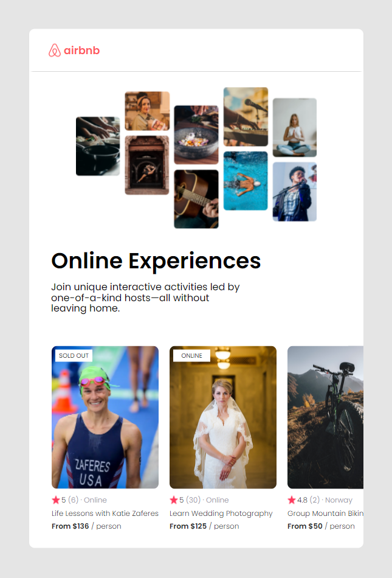

This airbnb page clone was created as a guided project for the Free Code Camp Learn React course
from Bob Ziroll.

The project uses React props passed as a spread object and conditional rendering.

This project was bootstrapped with [Create React App](https://github.com/facebook/create-react-app).

## Available Scripts

In the project directory, you can run:

### `npm start`

Runs the app in the development mode.\
Open [http://localhost:3000](http://localhost:3000) to view it in your browser.